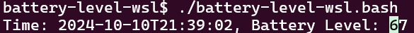
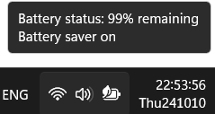

# battery-level-wsl
Shows battery level in Windows Subsystem for Linux (WSL).  
It refreshes at each second.  

## Usage
```bash
bash battery-level-wsl.bash
```

## Example outputs
```plain-text
Time: 2024-10-10T23:03:08, Battery Level: 94
```

## Screenshot


## Why this program is written
The program shows battery level as a number, which has more detail than original pictorial info. in Windows taskbar.  

## Development
The powershell command that prints battery level contains carriage return (`\r`), so the output overwrites the output of previous second.

## Example usage scenario
Windows requires hover on the battery icon for certain amount of time to show battery level, which is inconvenient when sharing a charger between multiple devices.  

