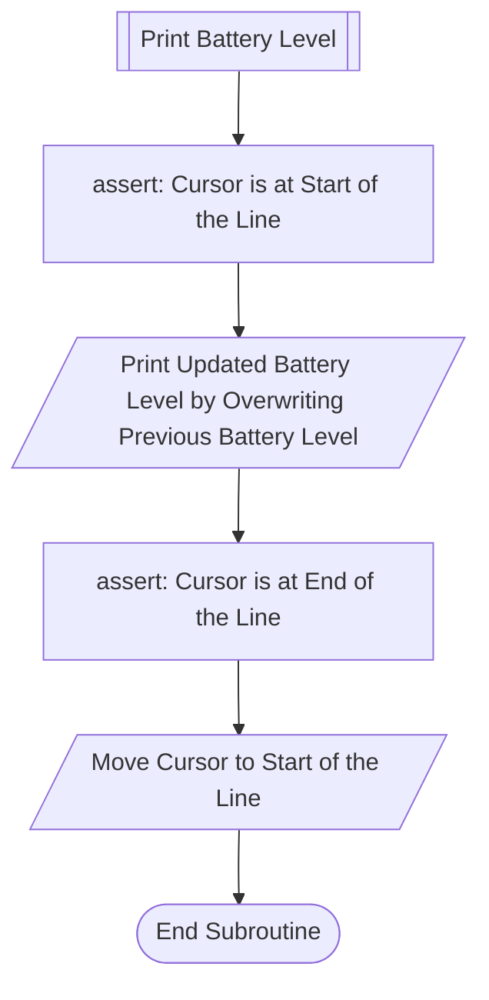

# battery-level-wsl
Shows battery level in Windows Subsystem for Linux (WSL).  
It refreshes at each second.  


## Usage
```bash
bash battery-level-wsl.bash
```

## Example outputs
```plain-text
Time: 2024-10-10T23:03:08, Battery Level: 94
```

## Screenshot


## Why this program is written
The program shows battery level as a number, which has more detail than original pictorial info. in Windows taskbar.  

## Development
The powershell command that prints battery level contains carriage return (`\r`), so the output overwrites the output of previous second.
### Overview of the Program Flow

### Subroutine: Print Battery Level


## Example usage scenario
Windows requires hover on the battery icon for certain amount of time to show battery level, which is inconvenient when sharing a charger between multiple devices.  


## Installation
Run following commands to install the program:
```bash
git clone https://github.com/WingTillDie/battery-level-wsl.git
cd battery-level-wsl/
chmod u+x battery-level-wsl.bash
ln -s $(readlink -f battery-level-wsl.bash) ~/.local/bin/my_bin/battery-level-wsl.bash
```

If installation success, then you can run following command directly:
```bash
battery-level-wsl.bash
```

You might need to modify your ~/.bashrc to make it works:
```bash
export MY_BIN="$HOME/.local/bin/my_bin"
export PATH="$PATH:$MY_BIN"
```
